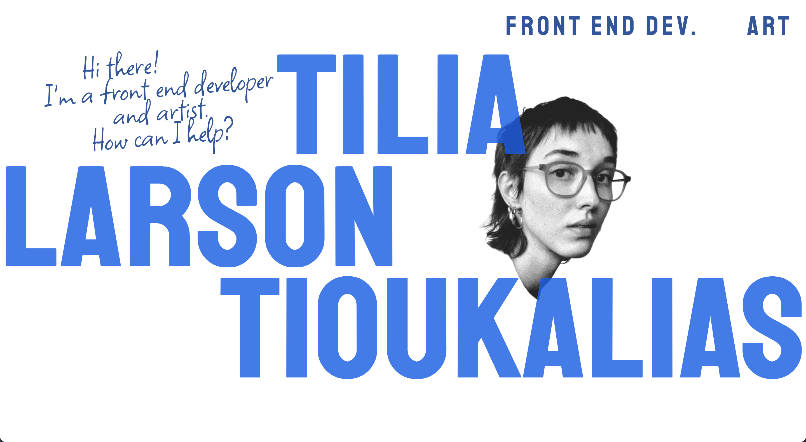
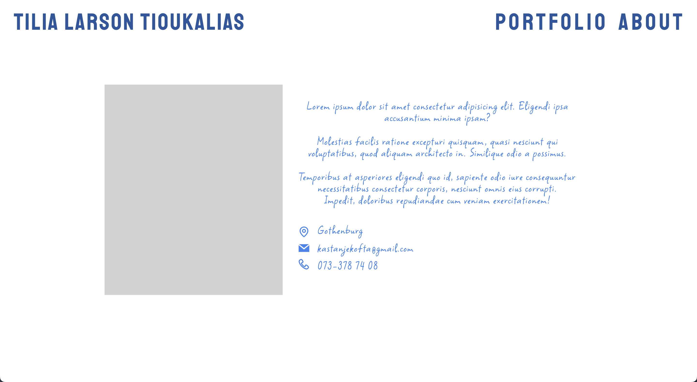
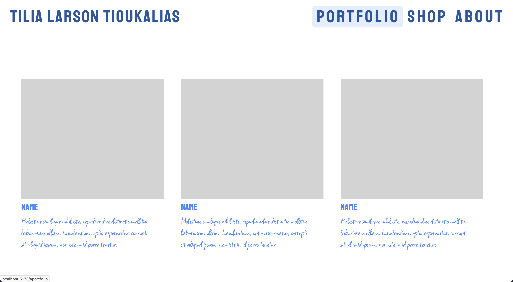
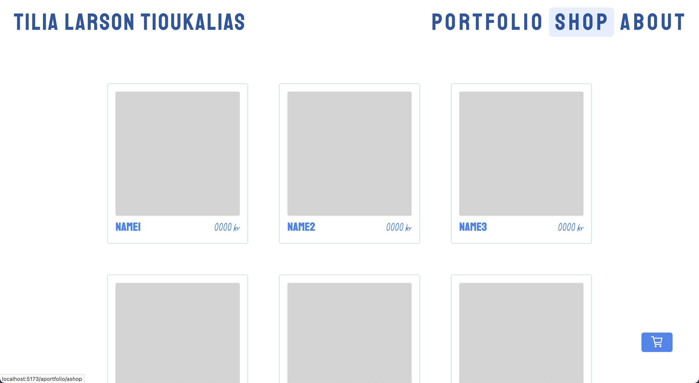

# Portfolio Website

This is a first attempt at a portfolio website for myself, and the assignment for a one month React course. It's built using React and CSS.

The idea was to have a home page where the user can navigate to one of my two areas, whichever is relevant to them - frontend development or art. The kind of design I wanted to test out was a clean, bright and high contrast one. Contrasting font styles in a bright color, combined with black and white imaging.

Since it's not a website I would want to use with its current format/design, I haven't continued the development.

# Screen Shots

# Installation and Setup Instructions
Clone down this repository. You will need node and npm installed globally on your machine.

Installation:

npm install

To Start Server:

npm run dev

To Visit App:

o

(or)

localhost:3000/ideas

